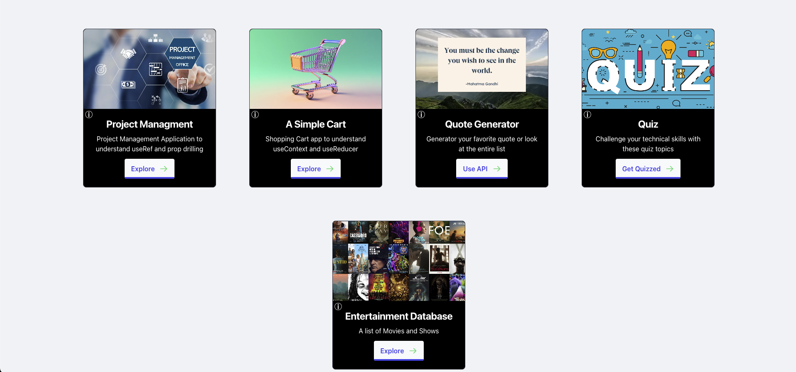

# THE LEARNING PROCESS: A website where I document my learning during unemployment

# Website:

<a href="https://api-generator-frontend.vercel.app/" target="_blank">Link</a>

# Screenshot:

# Technical Details:

- The Application was built using various tools including React, Redux, Express, ElephantSQL, TailwindCSS and SCSS
- Used OMDB API to fetch movies and shows
- Implemented redux for global state management for Entertainment Database
- Implemented useContext for global state management for Quote Generator
- Used Axios for API calls
- Quotes and HTTP data were obtained through a json file and parsed to PostgreSQL and then hosted via ElephantSQL
- Implemented Docker for containerizing ensuring consistent environments

# Key Features:

- Five Categories to choose from:
  - Project Managment App
  - A Simple Cart
  - Quote Generator
  - HTTP Code Game
  - React Quiz
  - Entertainment Database using OMDB's API
- Mobile Responsive

# Future Improvements:

Upcoming features will include more projects and quizzes to play around with

# API endpoints:

| Endpoint | Method | Description        |
| -------- | ------ | ------------------ |
| /http    | GET    | Get all HTTP Codes |
| /quotes  | GET    | Get all quotes     |

# References

1. HTTP codes from: https://status.js.org/codes.json
2. Quotes data from: https://gist.github.com/nasrulhazim/54b659e43b1035215cd0ba1d4577ee80
3. Redux documentation: https://redux.js.org/
4. OMDB API: https://www.omdbapi.com/
